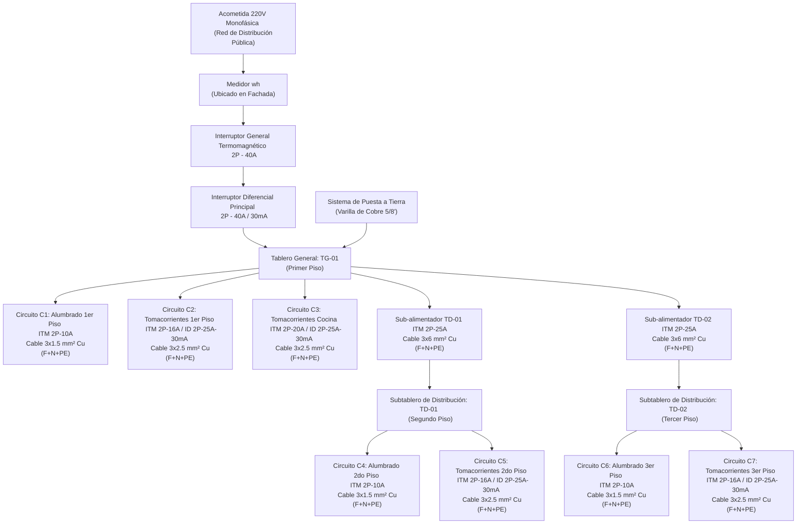

# DIAGRAMAS UNIFILARES DEL PROYECTO
## Proyecto: Instalación Eléctrica Residencial - Vivienda Unifamiliar de 3 Pisos

Este documento detalla el esquema de conexión unifilar de la vivienda unifamiliar de tres pisos. Se incluye el Diagrama Unifilar General del Proyecto y los diagramas unifilares de distribución de cada uno de los niveles (TG-01, TD-01, TD-02).

---

### 1. Diagrama Unifilar General del Proyecto

A continuación se presenta el flujo de alimentación general desde la acometida de la red pública, pasando por el medidor, el Tablero General y los Subtableros secundarios de distribución:



---

### 2. Diagrama Unifilar del Primer Piso (Tablero General TG-01)

El Tablero General (TG-01) recibe la acometida de la calle y distribuye el alumbrado y tomacorrientes del primer piso, además de las alimentaciones para los pisos superiores.

```text
       Línea de Acometida (Monofásico 220V, 60Hz)
                    │
           [Medidor Wh en Fachada]
                    │
            [ITM General 2P-40A]
                    │
          [ID Principal 2P-40A / 30mA]
                    │
        ┌───────────┴────────────────────────────────────────┐
        │                 TABLERO GENERAL TG-01             │
        ├────────────────────────────────────────────────────┤
        │  [Barra de Neutro]        [Barra de Tierra (PE)]   │
        │         │                          │               │
        │         │                          └────── Pozo    │
        │         │                                  Tierra  │
        ├─────────┼──────────┬──────────┬──────────┬─────────┤
        │         │          │          │          │         │
      [C1]      [C2]       [C3]    [Alim. TD01] [Alim. TD02] │
    Alumbrado  T.C. Gral   Cocina   Piso 2 sub   Piso 3 sub  │
     2P-10A    2P-16A      2P-20A     2P-25A       2P-25A    │
        │         │          │          │            │       │
      ID-25A    ID-25A     ID-25A       │            │       │
     (30 mA)   (30 mA)    (30 mA)       │            │       │
        │         │          │          │            │       │
    3x1.5 mm²  3x2.5 mm²  3x2.5 mm²  3x6.0 mm²    3x6.0 mm²  │
     (PVC 3/4") (PVC 3/4") (PVC 3/4") (PVC 1")     (PVC 1")  │
        │         │          │          │            │       │
      Luz       Tomas      Tomas      A TD-01      A TD-02   │
        └─────────┴──────────┴──────────┴────────────┘       
```

---

### 3. Diagrama Unifilar del Segundo Piso (Subtablero TD-01)

El Subtablero 1 (TD-01) está ubicado en el hall del segundo piso y distribuye la energía para las luminarias y tomacorrientes del nivel intermedio.

```text
                  Alimentación desde TG-01
                             │
                      [Cable 3x6 mm²]
                             │
                     [ITM General 2P-25A]
                             │
        ┌────────────────────┴──────────────────────┐
        │            SUBTABLERO DE DISTRIBUCIÓN     │
        │                     TD-01                 │
        ├───────────────────────────────────────────┤
        │                                           │
      [C4]                                        [C5]
    Alumbrado                                 Tomacorrientes
     2P-10A                                      2P-16A
        │                                           │
        │                                         ID-25A
        │                                        (30 mA)
        │                                           │
    3x1.5 mm²                                   3x2.5 mm²
    (PVC 3/4")                                  (PVC 3/4")
        │                                           │
     Luz 2do Piso                               Tomas 2do Piso
```

---

### 4. Diagrama Unifilar del Tercer Piso (Subtablero TD-02)

El Subtablero 2 (TD-02) se ubica en el pasadizo del tercer piso, controlando de manera local las luminarias y tomacorrientes de las habitaciones superiores.

```text
                  Alimentación desde TG-01
                             │
                      [Cable 3x6 mm²]
                             │
                     [ITM General 2P-25A]
                             │
        ┌────────────────────┴──────────────────────┐
        │            SUBTABLERO DE DISTRIBUCIÓN     │
        │                     TD-02                 │
        ├───────────────────────────────────────────┤
        │                                           │
      [C6]                                        [C7]
    Alumbrado                                 Tomacorrientes
     2P-10A                                      2P-16A
        │                                           │
        │                                         ID-25A
        │                                        (30 mA)
        │                                           │
    3x1.5 mm²                                   3x2.5 mm²
    (PVC 3/4")                                  (PVC 3/4")
        │                                           │
     Luz 3er Piso                               Tomas 3er Piso
```

---

### 5. Resumen de Protección de Personas (Interruptores Diferenciales)
* **Principio de Funcionamiento:** Los interruptores diferenciales (ID) de **30 mA** instalados protegen de forma directa a las personas contra contactos indirectos y fugas a tierra.
* **Distribución:** Cada circuito de tomacorrientes (`C2`, `C3`, `C5`, `C7`) dispone de un diferencial asociado de **2P - 25 A / 30 mA**, lo que asegura que una falla en un tomacorriente no afecte al alumbrado.
