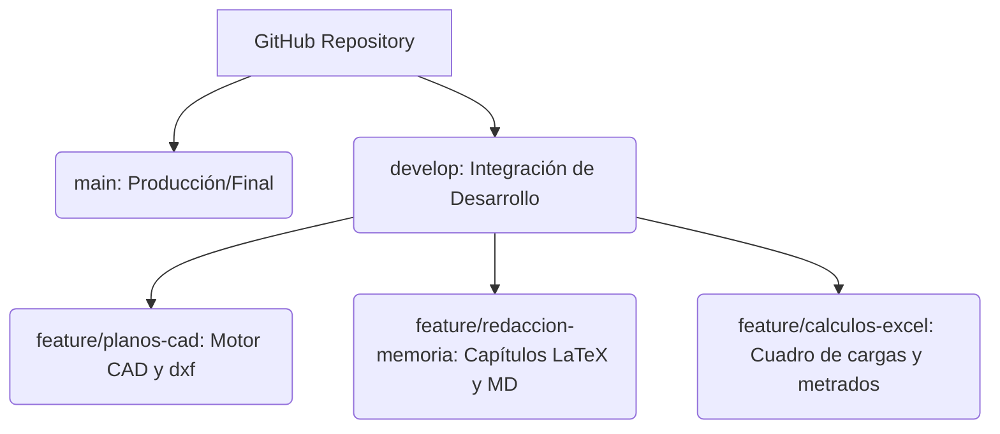

# Estrategia de Ramas Git y Flujo de Trabajo
**Proyecto:** Instalación Eléctrica Domiciliaria - Vivienda Unifamiliar de 3 Pisos  
**Propietario:** Renzo Gabriel Mamani Galindo  
**Ubicación:** Jr. Lima S/N, Capachica, Puno  

---

## 1. Estrategia de Ramas (GitFlow Simplificado)

En lugar de utilizar carpetas físicas para separar el trabajo de diferentes dispositivos, el control de versiones se gestiona íntegramente mediante ramas de Git. Esta estrategia optimiza la colaboración y evita conflictos al sincronizar cambios.



### Descripción de Ramas

*   **`main`**: Rama de producción. Contiene el expediente técnico definitivo listo para impresión (`main.pdf`) y los planos finales en su versión vectorizada PDF. Solo se fusionan en esta rama cambios que hayan sido verificados y compilen con cero errores.
*   **`develop`**: Rama base de desarrollo. Concentra las integraciones de los capítulos, hojas de cálculo de metrados y archivos DXF. Es el punto de partida para las ramas de características.
*   **`feature/*`**: Ramas de características específicas (ej. `feature/plano-segundo-piso`, `feature/especificaciones-tecnicas`). Se crean a partir de `develop` y se vuelven a fusionar en ella una vez terminada la tarea.

---

## 2. Flujo de Trabajo según Dispositivo de Acceso

Aunque las ramas físicas se han eliminado para evitar confusiones en Git, el flujo de trabajo sigue la lógica del dispositivo:

1.  **Celular (Recopilación e Investigación):**
    *   **Uso:** Recolección de fotos en obra, coordenadas catastrales y consulta rápida de precios de materiales en Sodimac/Promart.
    *   **Workflow:** Trabajar sobre ramas cortas de tipo `feature/campo-precios`.
2.  **Tablet (Redacción y Edición de Texto):**
    *   **Uso:** Modificación de capítulos `.tex` (Memoria Descriptiva, Especificaciones Técnicas) y correcciones ortográficas.
    *   **Workflow:** Trabajar en la rama `feature/redaccion-memoria`.
3.  **Laptop (Coordinación Técnica y Compilación):**
    *   **Uso:** Modificaciones en cálculos de potencia, codificación en Python para metrados/CAD, generación de planos DXF y compilación final de LaTeX.
    *   **Workflow:** Integrar ramas en `develop` y compilar el documento en el entorno local de MiKTeX/pdflatex.

---

## 3. Comandos de Sincronización Recomendados

Para evitar conflictos de fusión al cambiar de dispositivo:

```bash
# 1. Antes de iniciar a trabajar en un dispositivo:
git checkout develop
git pull origin develop

# 2. Crear una rama de características para el trabajo:
git checkout -b feature/mi-mejora

# 3. Tras finalizar el trabajo, hacer commit y push:
git add .
git commit -m "docs: actualiza capítulo de especificaciones de materiales"
git push origin feature/mi-mejora

# 4. Fusionar los cambios en develop (a través de GitHub PR o localmente):
git checkout develop
git merge feature/mi-mejora
git push origin develop
```
